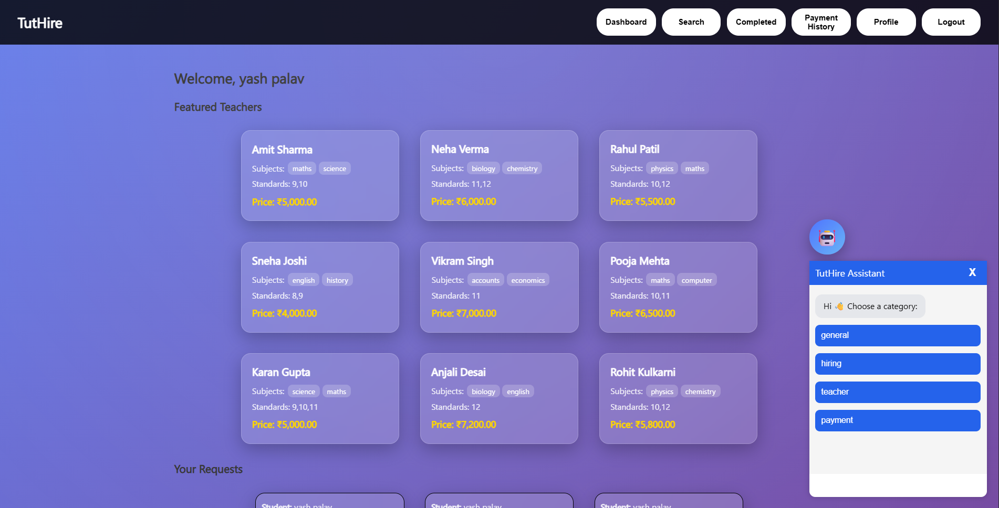
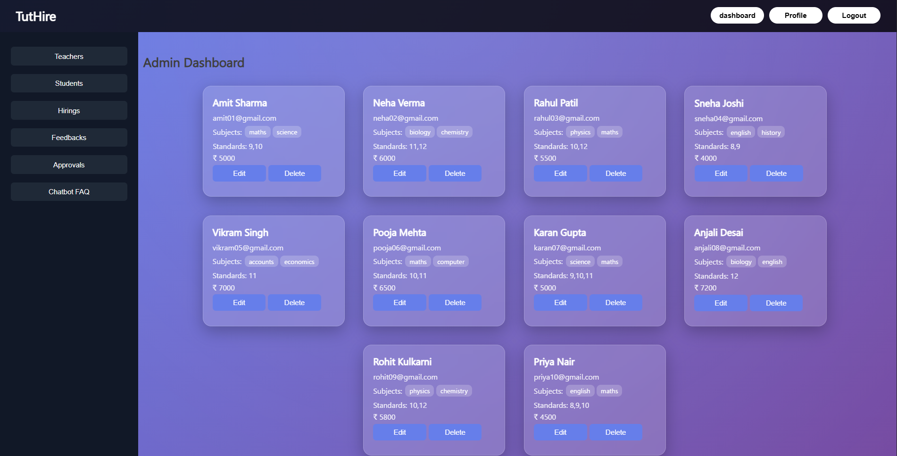

# 🎓 TutHire – Tutor Hiring Platform

TutHire is a **full-stack web application** that connects students with teachers for personalized learning.

It enables students to find tutors, book sessions, and interact using a chatbot, while teachers and admins manage availability, hiring, and system data.

---

## 🚀 Features

### 👨‍🎓 Student
- Register & Login  
- Browse teachers  
- View availability slots  
- Book sessions  
- Make payments  
- Give feedback  
- Use chatbot for assistance  

### 👩‍🏫 Teacher
- Manage profile  
- Add / edit availability slots  
- Accept / reject hiring requests  
- View feedback  

### 🛠️ Admin
- Manage teachers & students  
- Approve payments  
- Manage hirings  
- Edit / delete feedback  
- Manage chatbot FAQs  

### 🤖 Chatbot
- FAQ-based intelligent responses  
- Fetches answers from database  
- Admin-controlled content  

---

## 🏗️ Tech Stack

### 🔹 Frontend
- HTML  
- CSS  
- JavaScript  

### 🔹 Backend
- Java (Spring Boot)  
- REST APIs  

### 🔹 Database
- MySQL  

---

## 📂 Project Structure

```
tuthire/
│
├── src/
│   ├── controller/
│   ├── service/
│   ├── repository/
│   └── entity/
│
├── resources/
│   └── static/
│       ├── css/
│       ├── js/
│       └── html/
│
└── README.md
```

---

## ⚙️ Installation & Setup

### 1️⃣ Clone Repository

```bash
git clone https://github.com/YP-100/tuthire.git
cd tuthire
```

### 2️⃣ Configure Database

Create a MySQL database and update your `application.properties`:

```properties
spring.datasource.url=jdbc:mysql://localhost:3306/tuthire
spring.datasource.username=root
spring.datasource.password=your_password
spring.jpa.hibernate.ddl-auto=update
```

### 3️⃣ Run Backend

```bash
mvn spring-boot:run
```

### 4️⃣ Run Frontend

- Open `dashboard.html` in your browser  
OR  
- Use Live Server (recommended)

---

## 📸 Screenshots

### 🏠 Dashboard


---

### 👥 Admin Panel Users


---

## 📊 System Modules

- Authentication System  
- Availability Management  
- Hiring System  
- Payment Module  
- Feedback System  
- Chatbot Module  

---

## 📈 Future Enhancements

- AI-based chatbot (NLP)  
- Real-time chat system  
- Payment gateway integration  
- Mobile app version  

---

## 📚 Learning Outcomes

- Full-stack web development  
- REST API design  
- Role-based authentication  
- Database integration (MySQL)  
- UI/UX design  
- System architecture  

---

## 📄 License

This project is licensed under the **MIT License**.

---

## ⭐ Support

If you like this project, give it a ⭐ on GitHub!
